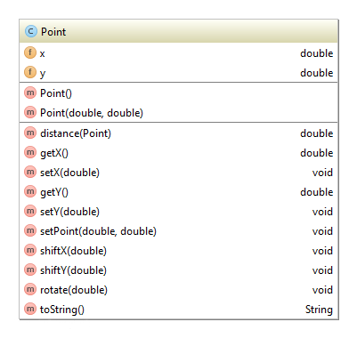

# Project 1
### Objectives
This assignment is designed just to get you going on the use of GitHub, IntelliJ and provide a review of basic Java concepts.  This should be an easy 50 points for you.

### Concepts Covered
* Java class design
* Basic Java concepts
* UML

### Details
* Review Java programming basics paying close attention to creating custom classes.
* Download the project template from https://github.com/UltimateSandbox/project-1-initial.git (Links to an external site.)  
```text
(Hint:  The easiest way to get the template is to just fork it into your repo, then clone it from there to your computer using the New Project from Existing Sources option in IntelliJ.)
```
Complete the following programming assignment:
* Design & implement a class called Point that represents a location in the Cartesian plane.
* Include (at a minimum) the following methods:
- setX(double x), setY(double y), setPoint(double x, double y) - set the coordinates of the point.
- shiftX(double n), shiftY(double n) - shift a point by a given amount along one of the axes.
- distance(Point p2) - finds the distance to point p2.
- rotate(double angle) - rotates the point by a specified angle around the origin. The formula for rotation is as follows:
```text
x′=xcos(θ)−ysin(θ)
y′=xsin(θ)+ycos(θ)
```

* Any other methods you believe to be necessary.
* Your code should work with the driver class provided (Project1.java).
* Use the driver with no code modifications to test your class for the correct results.
* Use the informal UML below to complete your Point class.



### Expected Output
Once you get your Point class working, when you run the driver, you should see something similar to the following:
```text
Project 1 : Point Tester

Point 1: Point{x=3.0, y=1.0}
Point 2: Point{x=6.0, y=5.0}

Distance: 5.0

Rotated a 1.5707963267948966: Point{x=-0.9999999999999998, y=3.0}
Shifted b 4.47213595499958 away from original position: Point{x=10.0, y=3.0}

```

### Extra Credit
If you would like up to 10 points extra credit for this assignment, utilize a code generation AI to write the class.  To get the extra credit points, you must include the text you used to generate the class in a multi-line comment just above the class header.  Utilize [ChatGPT](https://chat.openai.com/Links) for this assignment.  Make sure the AI generates all methods mentioned above for full credit.

The trick with this extra credit isn't necessarily figuring out what to ask the AI - you also have to get the AI code to work with the given driver class as-is.  In other words, you'll need to make changes to the class name as well as method names to get the driver to work as expected.

### Helpful Hints 
- The rotate method implementation has a trick to it that you need to consider when implementing.  Remember, if you modify the x value, then try to use it in the y value calculation, you'll get the wrong answer.  (You need to temporarily store the new x value and use the original for the y calculation.)
- Utilize the Math class for the algorithm implementation.
- Utilize Google to find the distance formula.
- Make good use of whitespace and comments to make your implementation as clean as possible.
- Use good, SOLID object-oriented programming principles (pun intended) in your implementation.
### Deliverables
- Be sure you commit & push your code to GitHub.  If you don't push it, I won't be able to see it!
- Copy the URL for your repo (green button on your GitHub repos' page) and paste it into the Website URL field and click Submit Assignment!
